<h1>Yumi and Walking-Robot</h1>

<b>TEL200: Project task in introductory robotics 2026</b>

<b><a href="https://www.nmbu.no/">@University of Life Sciences</a></b>

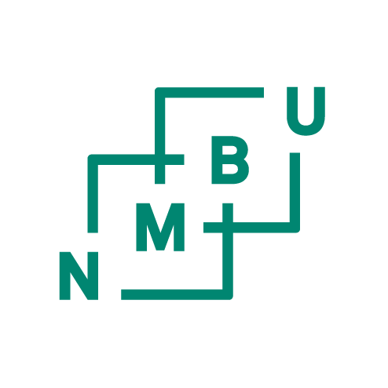

<ul>
<b>Made by the most wonderful Group-5</b>
    <li>Håkon Bekken (Realhaakon)</li>
    <li>Andreas Carelius Brustad (Suilerac)</li>
    <li>Johannes Husevåg Standal (JohannesStandal)</li>
</ul>

<h2>Project 1: Yumi Application</h2>

A robotic drawing challenge using the ABB YuMi robot arm. The robot picks up a pen and draws target shapes on paper.

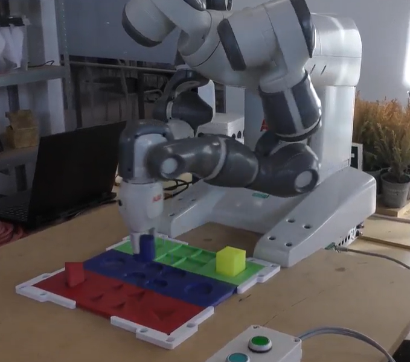

<table>
<tr>
<td>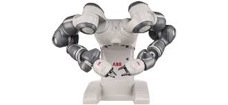</td>
<td>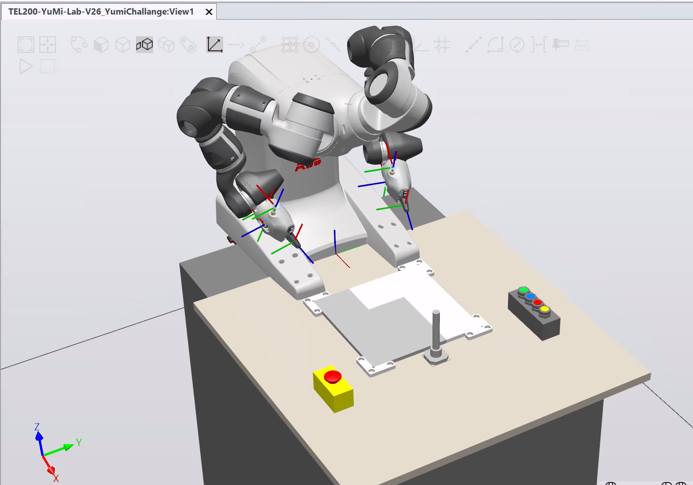</td>
</tr>
<tr>
<td>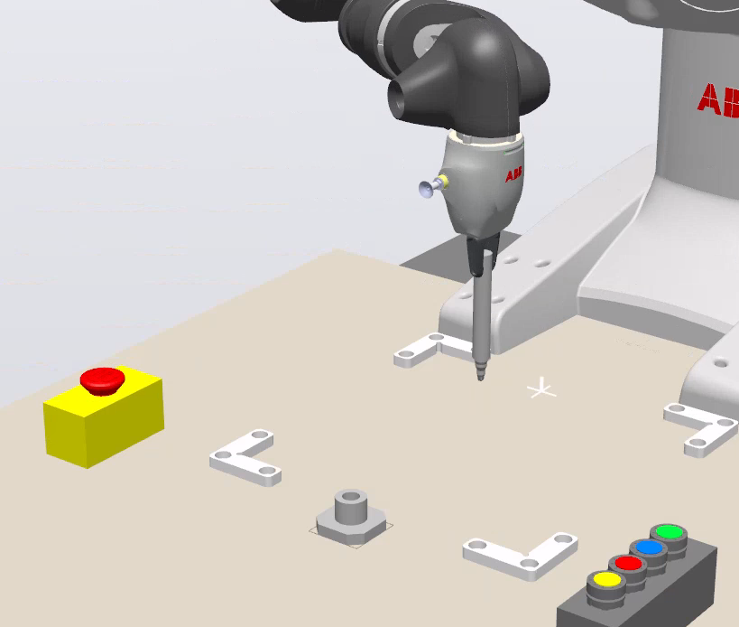</td>
<td>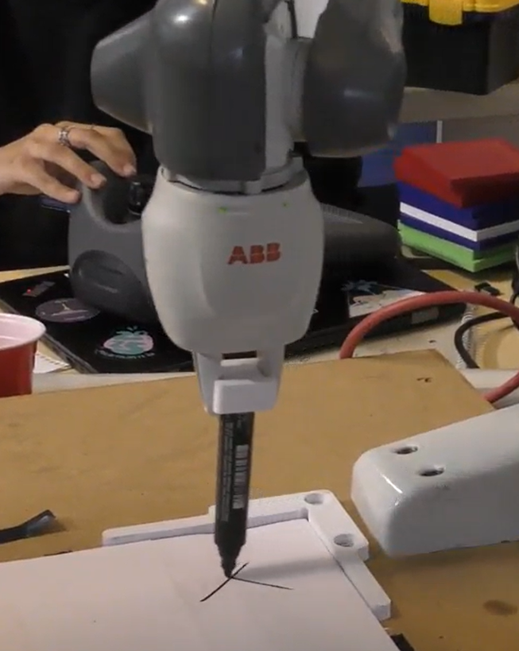</td>
</tr>
</table>

<h2>Project 2: Walking Robot</h2>

A differential-drive robot navigating using path planning algorithms such as PRM (Probabilistic Roadmap) and A*.

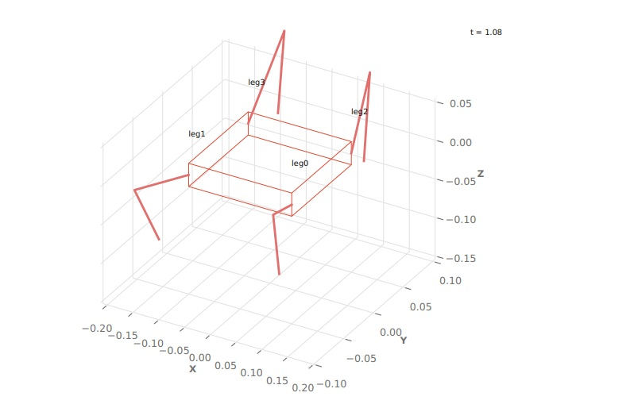

<table>
<tr>
<td>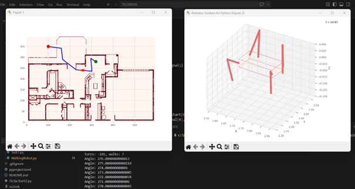</td>
<td>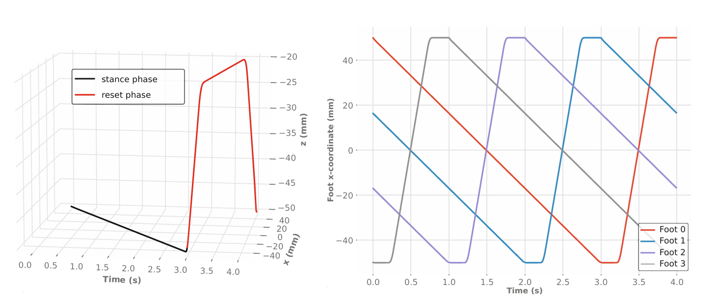</td>
</tr>
<tr>
<td>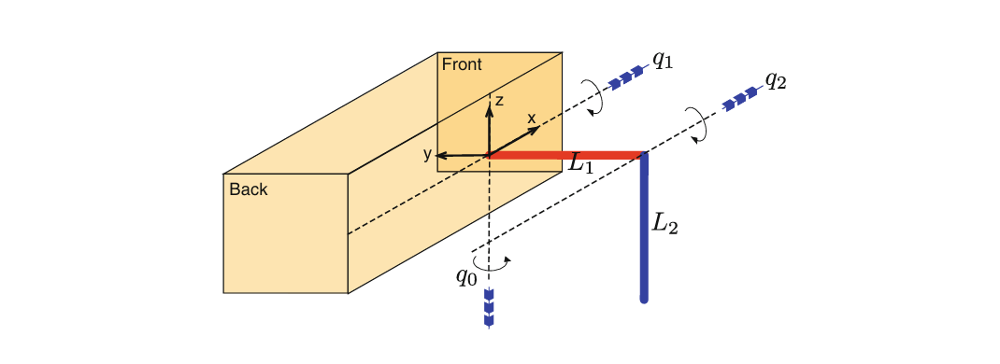</td>
<td>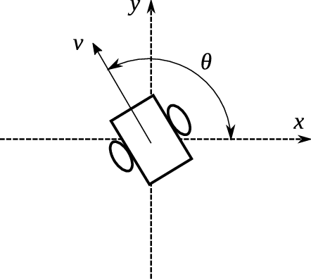</td>
</tr>
</table>

